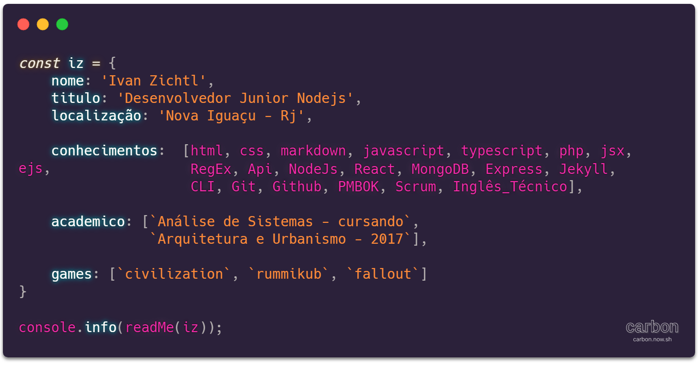

## Ivan Zichtl

>Desenvolvedor Web junior/iniciante e  Arquiteto e Urbanista por formação. Estudo com objetivo de ingressar
na área do desenvolvimento. 

### Conhecimentos:
- #php #nodejs #javascript #typescript #react #NoSql #Sql #NoSql #Sql ...
- 
### Atualmente Estudo: 
- Linguagens + Orientação a objetos, Arquitetura de Software e Algoritmos. 

- 📫 izichtl@gmail.com

<!---
izichtl/izichtl is a ✨ special ✨ repository because its `README.md` (this file) appears on your GitHub profile.
You can click the Preview link to take a look at your changes.
--->
